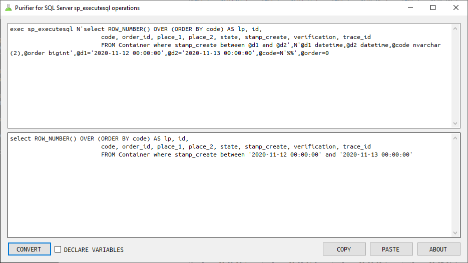
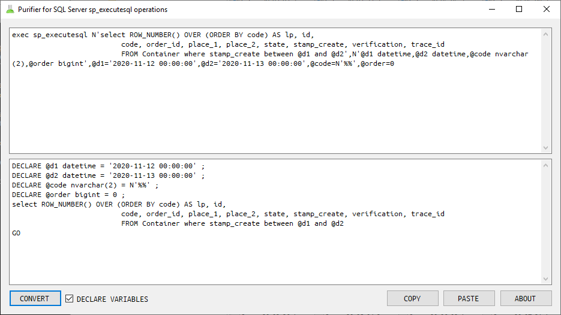

Purifier for SQL Server sp_executesql operations
================================================

This simple desktop application converts SQL Server scripts that uses ``sp_executesql`` to simple ``SELECT`` queries.

Download
--------

Compiled versions can be found [here](download/).

Example
-------

Consider following example scripts.

```sql
exec sp_executesql N'SELECT * FROM [my_table] WHERE [id] = @id',N'@id bigint',@id=241
```

```sql
exec sp_executesql N'
update [history] set stop = @stop_time where id = @id
',N'@stop_time datetime,@id bigint',@stop_time='2020-05-26 03:25:10.500',@id=9200651
```

Using this tool you might quickly convert them to standard queries, without using ``sp_executesql`` which might be useful when checking execution plans.

```sql
SELECT * FROM [my_table] WHERE [id] = 241
```

```sql
DECLARE @id bigint = 241 ;
SELECT * FROM [my_table] WHERE [id] = @id
GO
```

```sql
update [history] set stop = '2020-05-26 03:25:10.500' where id = 9200651
```

```sql
DECLARE @stop_time datetime = '2020-05-26 03:25:10.500' ;
DECLARE @id bigint = 9200651 ;

update [history] set stop = @stop_time where id = @id
GO
```




